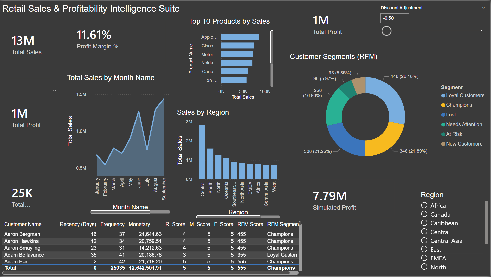
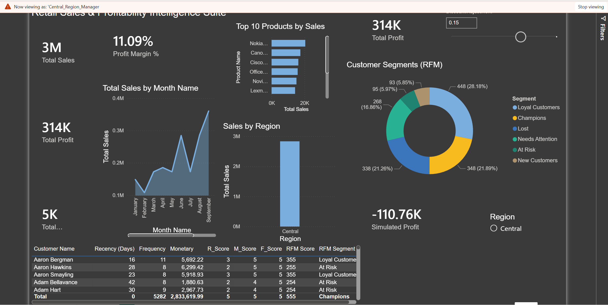
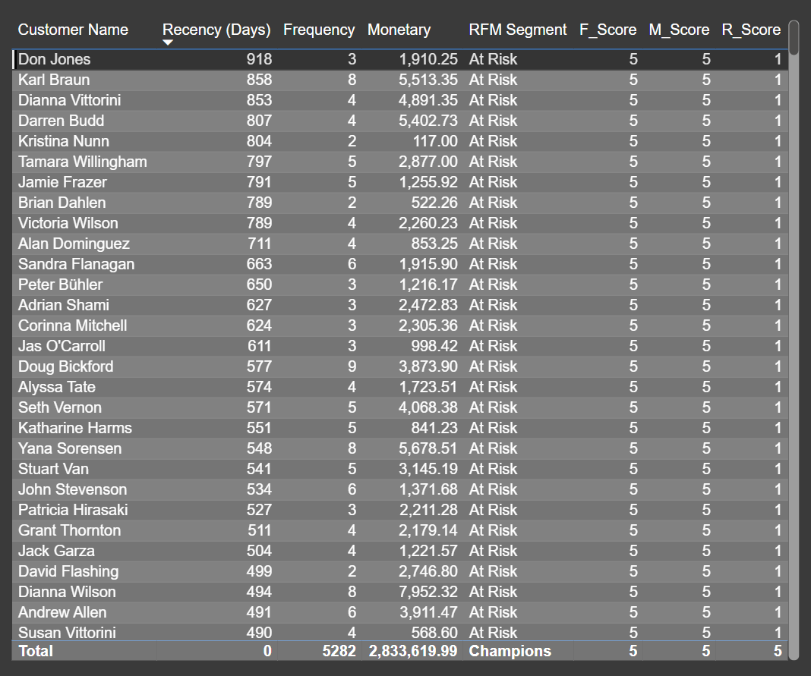
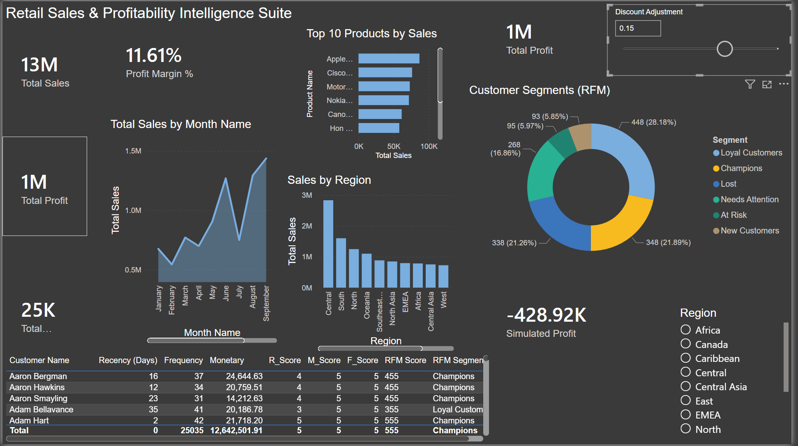

# Retail Sales & Profitability Intelligence Suite

An end-to-end Power BI dashboard analyzing sales, profitability, and customer behavior for a global retail dataset (51,290 transactions, 2011–2014), built on a proper star schema with advanced DAX modeling.

## Business Questions Answered

1. **Which customers should we prioritize for retention efforts?** — RFM segmentation classifies every customer into Champions, Loyal Customers, At Risk, Lost, New Customers, and Needs Attention based on Recency, Frequency, and Monetary value.
2. **What's the profit impact of changing our discount strategy?** — An interactive What-If parameter lets stakeholders simulate discount adjustments and see the projected profit impact in real time.
3. **Which regions and products are driving (or dragging) performance?** — Regional and product-level breakdowns identify Central as the top-performing region and surface the top 10 products by sales.
4. **How would access differ across regional managers?** — Row-Level Security demonstrates how the same report would restrict data access for a Central Region Manager vs. a West Region Manager in a real deployment.

## Data

- **Source:** Global Superstore dataset (Kaggle)
- **Volume:** 51,290 order-line rows
- **Cleaning:** Fixed locale-ambiguous date fields (DD-MM-YYYY text → proper Date type), corrected numeric fields that were importing as text, handled duplicate city names across different states.

## Data Model

Built as a proper star schema — a central `Fact_Orders` table connected to four dimension tables (`Dim_Customer`, `Dim_Product`, `Dim_Region`, `Dim_Date`) via one-to-many relationships, rather than a single flat table. A composite `CityState` key was introduced to resolve duplicate city names (e.g., two different "Redmond"s) that broke a direct City-only relationship.

## Key DAX Work

- **Time intelligence:** Monthly trend measures with a custom Date dimension table and explicit `Sort by Column` to fix chronological ordering.
- **RFM Segmentation:** Recency/Frequency/Monetary scores computed via `PERCENTILEX.INC` against the full unfiltered customer base (`ALL(Dim_Customer)`), combined through `SWITCH` logic into readable segment labels, materialized into a calculated table for chart compatibility.
- **What-If Simulation:** A numeric range parameter feeding a `Simulated Profit` measure that models discount-adjustment impact anchored to the real baseline margin — `Simulated Profit = [Total Sales] * ([Profit Margin %] - [Discount Adjustment])`.
- **Row-Level Security:** Two regional roles restricting data visibility by `Dim_Region[Region]`, verified via View As.

## Features

- KPI overview (Total Sales, Total Profit, Profit Margin %, Total Orders)
- Monthly sales trend
- Top 10 products by sales
- Sales by region
- Customer segmentation (RFM) donut chart

- Drillthrough page: Region → Customer-level detail

- What-If discount impact simulator

- Row-Level Security by region

## Assumptions & Limitations

- Discount-impact simulation assumes a linear relationship between discount adjustment and margin — a simplification, since no true product-cost data was available in the source dataset.
- RLS roles are demonstrated via Power BI Desktop's "View As" feature; full enforcement requires deployment to Power BI Service with roles mapped to real user accounts.

## Tools

Power BI Desktop, Power Query (M), DAX

## Files

- `Global_Superstore_Sales_Profitability_Dashboard.pbix` — full Power BI file
- Dashboard screenshots included in this repo
